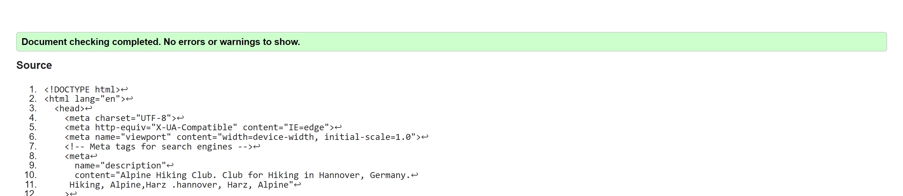

# ALPINE HIKING CLUB

This website is a site where the hikers and outdoor actvists can find everything they desire. 
As the people of Europe are found of outdoor activities, this site atracts the wast majority of people 
hikers and trackers can join here to meet other people with same interests and hobbies.
Theis site provides very easy excess to the traning sessions and planning sessions.
website provides opportunities to hobbyists to fulfill there desires. 
 Site provides information about popular hiking and tracking locations of the Europe.

The goal of this website is to keep people physically and mentally fit . To motivate people for such interesting and adventures hobbies like hiking and tracking. 
over Goal is to provide people very easy access to these wonderful hobies. 
We wish to be helpful is this way, building a healthy and positive society.

## Features 

In this section, you should go over the different parts of your project, and describe each in a sentence or so. You will need to explain what value each of the features provides for the user, focusing on who this website is for, what it is that they want to achieve and how your project is the best way to help them achieve these things.

### Existing Features

- __Navigation Bar__

  - Featured on all three pages, the full responsive navigation bar includes links to the Logo, Home page, Gallery and Sign Up page and is identical in each page to allow for easy navigation.
  - This section will allow the user to easily navigate from page to page across all devices without having to revert back to the previous page via the ‘back’ button. 

- __The landing page image__

  - The landing Page includes main image and photographs with titles and text and description and introduction of the spacific event.  
  - This section introduces the user to The Alpine Hiking Club with an attractive  to grab their attention

- __Hiking Locations Section__

  - In this section user will be introduced to the dream hiking location. 
this section encourages new people to join the club and adopt a healthy and adventurous hobby.  
  - There's brief description of different hiking locationc of Apls in different European countries. photographs of beautiful hiking loactions attracts users.

- __Events section__

  - In this sections user finds upcoming events, those are very important for hiking and tracking Hobbyists.
- Training Workshop . the traning workshops offers the mental and physical traning to make  people ready for hikes or tracking in different locations and weather conditions.
  - Tour planing Webinar. this  Section offers webinars those covers all details you need to plan for a spacific loaction and weather conditions hiking Tour.

- __The Footer__ 

  - The footer section includes links to the relevant social media sites for Love Running. The links will open to a new tab to allow easy navigation for the user. 
  - The footer is valuable to the user as it encourages them to keep connected via social media
  - Conact information , like Email and Phone number are displayed also in footer .

- __Gallery__

  - The gallery is most interesting page for users as there are plenty of beautiful photographs of Club members during different hiking tours. and mesmerizing scenarios shoot by Club members.
  - Photos in Gallery, provides exact information about the tours and Locations. encouraging for new people to join. 

- __The Sign Up Page__

  - On the sign up page user can join the Club in one step. only have to provide name Email address .
here user can choose the spacific Hiking tour or the training Workshop or the planning Webinars.
this page is attractive and user-friendly. 

For some/all of your features, you may choose to reference the specific project files that implement them.

In addition, you may also use this section to discuss plans for additional features to be implemented in the future:

### Features Left to Implement

- working on new Ideas .

## Testing 

the page is thoroughly tested by recommend validation sites.
- [W3C validator](https://validator.w3.org/nu/?doc=https%3A%2F%2Fcode-institute-org.github.io%2Flove-running-2.0%2Findex.html)

- [(Jigsaw) validator](https://jigsaw.w3.org/css-validator/validator?uri=https%3A%2F%2Fvalidator.w3.org%2Fnu%2F%3Fdoc%3Dhttps%253A%252F%252Fcode-institute-org.github.io%252Flove-running-2.0%252Findex.html&profile=css3svg&usermedium=all&warning=1&vextwarning=&lang=en#css)

screenshot are below.
during testing found only typing errors those are fixed successfully.
for t -he performances check, page is tested with (lighthouse )
there were some problem with images sizes and format, so the all images were converted to webp files. after replacing the image files with webp files. perfomance test achieved 100. 
screenshot is below.

### Validator Testing 

- HTML
  - No errors were returned when passing through the official [W3C validator](https://validator.w3.org/nu/?doc=https%3A%2F%2Fcode-institute-org.github.io%2Flove-running-2.0%2Findex.html)
  
  
  
- CSS
  - No errors were found when passing through the official [(Jigsaw) validator](https://jigsaw.w3.org/css-validator/validator?uri=https%3A%2F%2Fvalidator.w3.org%2Fnu%2F%3Fdoc%3Dhttps%253A%252F%252Fcode-institute-org.github.io%252Flove-running-2.0%252Findex.html&profile=css3svg&usermedium=all&warning=1&vextwarning=&lang=en#css)
  

  - Lighthous report
  

### Unfixed Bugs

There are no unfixed bugs or Errors.

## Deployment

Web page is successfuly deployed to Github. 

- The site was deployed to GitHub pages. The steps to deploy are as follows: 
  - In the GitHub repository, navigate to the Settings tab 
  - From the source section drop-down menu, select the Master Branch
  - Once the master branch has been selected, the page will be automatically refreshed with a detailed ribbon display to indicate the successful deployment. 

The live link can be found here - https://marcopolo1975.github.io/Alpine-Hiking-Club/

### Browser Compatibility

- Testing has been carried out on the following browsers :
    - Chrome Version 90.0.4430.212 (Official Build) (64-bit)
    - Firefox Version 88.0.1 (64-bit)
    - Edge Version 90.0.818.62 (Official build) (64-bit)
    - Safari on macOS Catalina (Safari  Version 14.0.3)

## Credits 

In this section you need to reference where you got your content, media and extra help from. It is common practice to use code from other repositories and tutorials, however, it is important to be very specific about these sources to avoid plagiarism. 

You can break the credits section up into Content and Media, depending on what you have included in your project. 

### Content 
### Content 
- Content on the landing  page was loosely based on hiking websites [hiking site](https://www.thehiking.club/)
- All other content was written by the developer

### Code
-  basic structure  code is inspired from love running project [Love runing](https://marcopolo1975.github.io/love-running/index.html)
- Taken help from W3Schools throughout the project. for fixing different issues, like positioning the content on desired place and desired fromat. [W3Schools](https://www.w3schools.com/)
- images are downloaded from Paxels.com [Pexels.com](https://www.pexels.com/photo/people-hiking-on-snow-covered-mountain-5311543/)

- Taken help throughout the project from youtube tutorials for HTML and CSS. [YouTube css Tutorial](https://www.youtube.com/results?search_query=css+tutorial+for+beginners)

- The icons in the footer were taken from [Font Awesome](https://fontawesome.com/)

### Media

- Photos for the project taken from Pexels.com
[Pexels.com](https://www.pexels.com/photo/people-hiking-on-snow-covered-mountain-5311543/)

